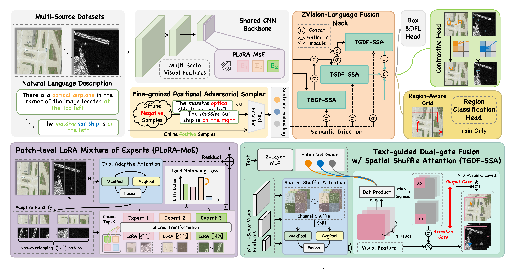
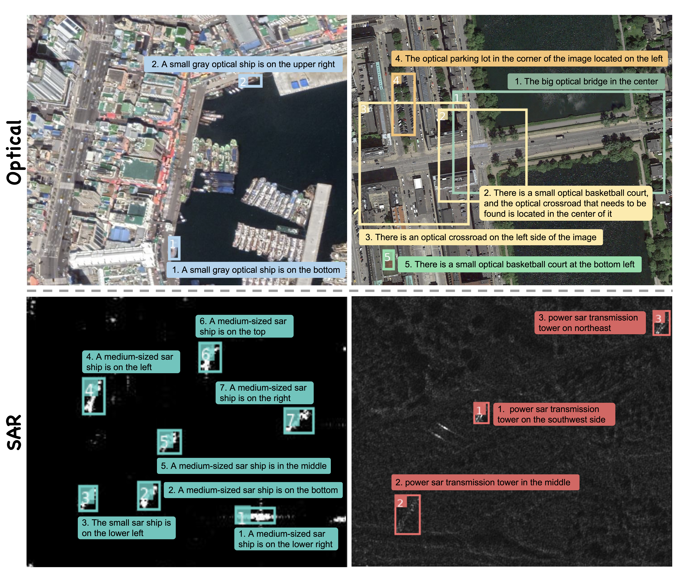

<h1 align="center">OptiSAR-Net++</h1>

<h3 align="center">A Large-Scale Benchmark and Transformer-Free Framework for Cross-Domain Remote Sensing Visual Grounding</h3>

<p align="center">Official PyTorch implementation of <strong>OptiSAR-Net++</strong>.</p>

<p align="center">
  <a href="https://arxiv.org/abs/2603.24876"></a>
  <a href="https://pan.baidu.com/s/1dkyKU-KJmu25xuAYAVyh1g?pwd=6666"></a>
  <a href="https://drive.google.com/drive/folders/1xBoYVcA295k3Yox-WCCHtxVhpFZ3ff_V?usp=share_link"></a>
  <a href="LICENSE"></a>
  <a href="https://www.python.org/"></a>
</p>


---

**Navigation:** [Overview](#overview) · [Results](#benchmark-results) · [Dataset](#optsar-rsvg-benchmark) · [Installation](#environment-and-installation) · [Training](#training) · [Evaluation](#evaluation) · [Inference](#inference) · [Citation](#citation)

## Overview

OptiSAR-Net++ addresses cross-domain remote sensing visual grounding (CD-RSVG) with a single model for optical and synthetic aperture radar (SAR) imagery. It replaces a heavy Transformer decoder with contrastive region-text matching and introduces three task-specific components:

- **PL-MoE** — patch-level low-rank adaptation mixture of experts for optical/SAR feature decoupling.
- **Fine-grained adversarial sampling** — dynamic negative prompts for direction, appearance, quantity, and domain cues.
- **TGDF-SSA and region-aware supervision** — efficient language-guided multi-scale fusion and auxiliary spatial learning.

<p align="center">
  
</p>

## Open-source release status

| Release | Status | Access |
|:--|:--:|:--|
| **Model code** | ✅ Available | [GitHub repository](https://github.com/JunDong-dev/OptiSAR-Net-PlusPlus) |
| **OptSAR-RSVG dataset** | ✅ Available | [Baidu Netdisk](https://pan.baidu.com/s/1dkyKU-KJmu25xuAYAVyh1g?pwd=6666) · extraction code: `6666` |
| **Model weights** | ✅ Available | [Google Drive](https://drive.google.com/drive/folders/1xBoYVcA295k3Yox-WCCHtxVhpFZ3ff_V?usp=share_link) |

## Benchmark results

Performance comparison on the OptSAR-RSVG benchmark. All metrics are percentages (%). **Bold** = best result · <u>Underline</u> = second-best result.

<div align="center">

<table>
  <thead>
    <tr>
      <th rowspan="2" align="left">Method</th>
      <th rowspan="2">Params<br>(M)</th>
      <th colspan="5" align="center">Optical Test Set</th>
      <th colspan="5" align="center">SAR Test Set</th>
      <th colspan="2" align="center">All Test Set</th>
    </tr>
    <tr>
      <th align="right">Pr@0.5</th>
      <th align="right">Pr@0.7</th>
      <th align="right">Pr@0.9</th>
      <th align="right">meanIoU</th>
      <th align="right">cumIoU</th>
      <th align="right">Pr@0.5</th>
      <th align="right">Pr@0.7</th>
      <th align="right">Pr@0.9</th>
      <th align="right">meanIoU</th>
      <th align="right">cumIoU</th>
      <th align="right">meanIoU</th>
      <th align="right">cumIoU</th>
    </tr>
  </thead>
  <tbody>
    <tr>
      <td colspan="14" align="left"><strong><em>Transformer-based</em></strong></td>
    </tr>
    <tr>
      <td align="left">TransVG</td><td align="right">149.7</td>
      <td align="right">43.06</td><td align="right">30.10</td><td align="right">3.23</td><td align="right">36.87</td><td align="right">39.86</td>
      <td align="right">65.99</td><td align="right">41.47</td><td align="right">1.64</td><td align="right">51.72</td><td align="right">20.04</td>
      <td align="right">40.69</td><td align="right">40.90</td>
    </tr>
    <tr>
      <td align="left">LQVG</td><td align="right">156.8</td>
      <td align="right"><u>89.64</u></td><td align="right"><u>80.06</u></td><td align="right">33.48</td><td align="right"><u>77.29</u></td><td align="right">82.75</td>
      <td align="right"><u>94.13</u></td><td align="right">87.39</td><td align="right">32.14</td><td align="right">80.76</td><td align="right">81.04</td>
      <td align="right"><u>78.04</u></td><td align="right">82.15</td>
    </tr>
    <tr>
      <td align="left">TACMT</td><td align="right">150.9</td>
      <td align="right">85.51</td><td align="right">79.53</td><td align="right"><u>42.20</u></td><td align="right">75.74</td><td align="right">79.98</td>
      <td align="right">92.87</td><td align="right">89.74</td><td align="right"><strong>38.29</strong></td><td align="right"><u>81.59</u></td><td align="right"><u>82.46</u></td>
      <td align="right">77.24</td><td align="right">81.40</td>
    </tr>
    <tr>
      <td align="left">CSDNet</td><td align="right">154.6</td>
      <td align="right">86.64</td><td align="right">77.86</td><td align="right">34.67</td><td align="right">75.48</td><td align="right"><u>83.20</u></td>
      <td align="right">93.55</td><td align="right"><u>90.13</u></td><td align="right">29.67</td><td align="right">81.00</td><td align="right">74.71</td>
      <td align="right">77.01</td><td align="right"><u>82.96</u></td>
    </tr>
    <tr>
      <td colspan="14" align="left"><strong><em>Contrastive learning-based</em></strong></td>
    </tr>
    <tr>
      <td align="left">G-DINO</td><td align="right">172.3</td>
      <td align="right">81.73</td><td align="right">75.82</td><td align="right">30.98</td><td align="right">71.26</td><td align="right">75.83</td>
      <td align="right">89.61</td><td align="right">85.14</td><td align="right">29.69</td><td align="right">78.24</td><td align="right">80.92</td>
      <td align="right">74.84</td><td align="right">78.74</td>
    </tr>
    <tr>
      <td align="left">GLIP</td><td align="right">231.8</td>
      <td align="right">67.83</td><td align="right">60.79</td><td align="right">24.74</td><td align="right">58.99</td><td align="right">76.27</td>
      <td align="right">88.25</td><td align="right">83.72</td><td align="right">24.13</td><td align="right">75.31</td><td align="right">81.55</td>
      <td align="right">63.17</td><td align="right">76.91</td>
    </tr>
    <tr>
      <td align="left"><strong>OptiSAR&#8209;Net++&nbsp;(Ours)</strong></td><td align="right"><strong>95.6</strong></td>
      <td align="right"><strong>90.37</strong></td><td align="right"><strong>86.83</strong></td><td align="right"><strong>68.89</strong></td><td align="right"><strong>83.17</strong></td><td align="right"><strong>88.83</strong></td>
      <td align="right"><strong>94.68</strong></td><td align="right"><strong>90.21</strong></td><td align="right"><u>37.22</u></td><td align="right"><strong>81.85</strong></td><td align="right"><strong>83.15</strong></td>
      <td align="right"><strong>82.76</strong></td><td align="right"><strong>90.70</strong></td>
    </tr>
  </tbody>
</table>

</div>

## OptSAR-RSVG benchmark

OptSAR-RSVG contains 46,825 images and 90,148 image-text-box annotations in 16 categories. The release uses one canonical test split; optical and SAR metrics are derived from the annotation category names rather than duplicated image directories.

<p align="center">
  
  <br>
  <em>Optical and SAR samples in the OptSAR-RSVG benchmark.</em>
</p>

<div align="center">

<table>
  <thead>
    <tr>
      <th align="left">Split</th>
      <th align="right">Images</th>
      <th align="right">Annotations</th>
    </tr>
  </thead>
  <tbody>
    <tr><td align="left">Train</td><td align="right">37,957</td><td align="right">74,049</td></tr>
    <tr><td align="left">Validation</td><td align="right">4,434</td><td align="right">7,996</td></tr>
    <tr><td align="left">Test</td><td align="right">4,434</td><td align="right">8,103</td></tr>
    <tr><td align="left"><strong>Total</strong></td><td align="right"><strong>46,825</strong></td><td align="right"><strong>90,148</strong></td></tr>
  </tbody>
</table>

<em>The splits follow an ≈ 8 : 1 : 1 ratio with category and modality balance.</em>

</div>

### Dataset download

- **OptSAR-RSVG dataset:** [Baidu Netdisk](https://pan.baidu.com/s/1dkyKU-KJmu25xuAYAVyh1g?pwd=6666) (extraction code: `6666`)


Please retain this directory layout after downloading:

```text
datasets/OptSAR-RSVG/
├── images/{train,val,test}/
├── labels/{train,val,test}/
├── train.json
├── val.json
└── test.json

checkpoints/
└── mobileclip2_b.pt
```

Image and label filenames use only the sensor domain and a six-digit, domain-global identifier:

```text
opt_000001.jpg  <->  opt_000001.txt
sar_000001.jpg  <->  sar_000001.txt
```

Identifiers are unique and continuous within each domain across `train`, `val`, and `test`, in that order. COCO JSON `file_name` fields use the same names.

### Source datasets

OptSAR-RSVG consolidates four public, single-source RSVG datasets. You can download and use the source data under the terms specified by their respective authors.

| OptSAR-RSVG subset | Source | Official access | Paper |
|---|---|---|---|
| Optical ships | RSVGD (released as RSSVG by VGRSS) | [VGRSS repository](https://github.com/LwZhan-WUT/VGRSS) · [Google Drive](https://drive.google.com/drive/folders/1pIZBbz9m27qs0bLyBZ7tap9bFUt_CpY3?usp=drive_link) | [VGRSS](https://doi.org/10.1109/TGRS.2025.3562717) |
| Optical, 14 categories | OPT-RSVG | [Official repository](https://github.com/like413/OPT-RSVG) · [Google Drive](https://drive.google.com/drive/folders/1e_WoTkruWAB2JXR7aqaMZMrM75IkjqCA?usp=drive_link) · [Baidu Netdisk (`92yk`)](https://pan.baidu.com/s/1vitw0yc-j0uFFHRPxVdZig) | [LPVA](https://doi.org/10.1109/TGRS.2024.3423663) |
| SAR ships | SARVG from VGRSS | [VGRSS repository](https://github.com/LwZhan-WUT/VGRSS) · [Google Drive](https://drive.google.com/drive/folders/1pIZBbz9m27qs0bLyBZ7tap9bFUt_CpY3?usp=drive_link) | [VGRSS](https://doi.org/10.1109/TGRS.2025.3562717) |
| SAR transmission towers | SARVG1.0 from TACMT | [Official repository](https://github.com/CAESAR-Radi/TACMT) · [Google Drive](https://drive.google.com/drive/folders/1Ed_tF7xJs3s721WXR1uS0Nss94p9C9nd?usp=sharing) · [Baidu Netdisk (`66y3`)](https://pan.baidu.com/s/1rE7UMFOS4LWvfbrfT85d0Q?pwd=66y3) | [TACMT](https://doi.org/10.1016/j.isprsjprs.2025.02.022) |

### Construction summary

OptSAR-RSVG is built in three stages:

1. **Collection and cleaning.** We merge RSVGD/RSSVG, OPT-RSVG, SARVG, and TACMT/SARVG1.0; remove invalid boxes; use detector-based low-IoU screening followed by manual review; merge 76 fine-grained RSVGD ship types into `ship`; and add `optical` or `sar` modality prefixes to category names.
2. **Augmentation and text rewriting.** Minority classes receive synchronized horizontal/vertical flips and 180-degree rotations. GPT-4o rewrites the descriptions and updates absolute directions, while an automated check compares directional words with transformed box centers. This stage adds 9,046 images and 19,136 annotations.
3. **Verification and splitting.** Box-target alignment and description correctness are manually reviewed, then samples are split with category and modality balance, targeting an 8:1:1 train/validation/test ratio. The exact released manifests and counts are listed above and are authoritative for reproduction.

The public package standardizes annotations as COCO JSON plus matching YOLO text labels. The image split determines the label and JSON split; do not independently reshuffle these files.

Validate a dataset copy before use:

```bash
python scripts/validate_dataset.py datasets/OptSAR-RSVG --strict-release
```

## Environment and installation

Use a Linux machine with an NVIDIA GPU and Conda or Mamba. Python 3.10 is recommended. The installation commands below install the required CUDA-enabled PyTorch build and all project dependencies; a separate CUDA toolkit is not required.

### Create the Conda environment

```bash
git clone https://github.com/JunDong-dev/OptiSAR-Net-PlusPlus.git
cd OptiSAR-Net-PlusPlus

conda create -n optisar python=3.10 -y
conda activate optisar
python -m pip install --upgrade pip setuptools wheel
python -m pip install --no-cache-dir -r requirements.txt
```

`requirements.txt` installs the CUDA 12.1 builds of PyTorch and Torchvision together with the remaining project dependencies.

### MobileCLIP2-B checkpoint

The experiments use Apple's frozen [MobileCLIP2-B](https://huggingface.co/apple/MobileCLIP2-B) text encoder. Download it before training:

```bash
mkdir -p checkpoints
wget -O checkpoints/mobileclip2_b.pt \
  https://huggingface.co/apple/MobileCLIP2-B/resolve/main/mobileclip2_b.pt
```

Set the checkpoint directory before training or evaluation:

```bash
export MOBILECLIP_WEIGHTS_DIR="$PWD/checkpoints"
```

## Data preparation

Training uses two generated artifacts that remain outside version control: a grounding cache and precomputed text embeddings.

```bash
python scripts/prepare_dataset_cache.py datasets/OptSAR-RSVG --split train

python scripts/prepare_text_embeddings.py datasets/OptSAR-RSVG \
  --dataset-name OptSAR_RSVG \
  --text-model mobileclip2:b \
  --output-dir artifacts/text_embeddings \
  --global-negatives 200 \
  --device cuda:0
```

Confirm that all generated artifacts exist before starting a long run:

```bash
test -s datasets/OptSAR-RSVG/train.cache
test -s artifacts/text_embeddings/mobileclip2:b/adv_OptSAR_RSVG_train_label_embeddings.pt
test -s artifacts/text_embeddings/mobileclip2:b/adv_OptSAR_RSVG_global_grounding_neg_embeddings_text200.pt
test -s artifacts/text_embeddings/adv_OptSAR_RSVG_global_grounding_neg_text200.json
echo "Data preparation check passed"
```

## Training

### Paper configuration


```bash
python scripts/train.py \
  --dataset-root datasets/OptSAR-RSVG \
  --device 0,1,2,3,4,5,6,7 \
  --batch 64 \
  --epochs 300 \
  --val-interval 20 \
  --project runs/train \
  --name optisar_net_pp_m
```

### Optional balanced modality sampling

Add `--balanced-modal-batch` to opt into 1:1 modality sampling. When enabled, every GPU receives equal numbers of Optical and SAR images in each local batch.

### Smoke test

Check the full data/model interface before a long run:

```bash
python scripts/train.py \
  --dataset-root datasets/OptSAR-RSVG \
  --device 0 \
  --batch 2 \
  --workers 2 \
  --dry-run \
  --project runs/reproduce \
  --name readme_dry_run
```

This one-epoch check uses 1% of the training split, disables validation, and writes `runs/reproduce/readme_dry_run/weights/last.pt` on a fresh run. The check verifies the complete data, text-embedding, loss, backward, checkpoint, and inference interfaces.

## Evaluation

The evaluator reports Pr@{0.5, 0.6, 0.7, 0.8, 0.9}, meanIoU, and cumIoU. A single pass over `test.json` also reports optical and SAR subsets.

```bash
python scripts/evaluate.py \
  --checkpoint /path/to/checkpoint.pt \
  --dataset-root datasets/OptSAR-RSVG \
  --split test \
  --device 0 \
  --output runs/eval/test_metrics.json
```

Use `--domain optical` or `--domain sar` to evaluate only one sensor domain, and `--limit 20` for an interface smoke test.

## Inference

```bash
python scripts/infer.py \
  --checkpoint /path/to/checkpoint.pt \
  --image example.jpg \
  --query "a massive SAR ship in the middle" \
  --device 0 \
  --save runs/infer/example.jpg
```

## Repository layout

```text
configs/       Model and dataset configuration
scripts/       Validation, preparation, training, evaluation, and inference
ultralytics/   Ultralytics runtime with OptiSAR-Net++ modules
assets/        README figures
```

The main model components are implemented in:

- `ultralytics/nn/modules/moe_new_patch.py` — PL-MoE
- `ultralytics/nn/modules/c2fatt.py` — TGDF-SSA
- `ultralytics/nn/modules/head.py` and `spatial_heads.py` — region-aware auxiliary head
- `ultralytics/data/augment.py` — adversarial text sampling

## Acknowledgements and license

This implementation builds on [YOLOE](https://github.com/THU-MIG/yoloe), [Ultralytics](https://github.com/ultralytics/ultralytics), [CLIP](https://github.com/openai/CLIP), and [MobileCLIP](https://github.com/apple/ml-mobileclip). We sincerely thank their authors for making their work publicly available. The code is released under the [AGPL-3.0 license](LICENSE). Please also follow the licenses and terms of the original datasets used to construct OptSAR-RSVG.

## Citation

```bibtex
@article{tang2026optisar,
  title={OptiSAR-Net++: A Large-Scale Benchmark and Transformer-Free Framework for Cross-Domain Remote Sensing Visual Grounding},
  author={Tang, Xiaoyu and Dong, Jun and Cheng, Jintao and Fan, Rui},
  journal={arXiv preprint arXiv:2603.24876},
  year={2026}
}
```
